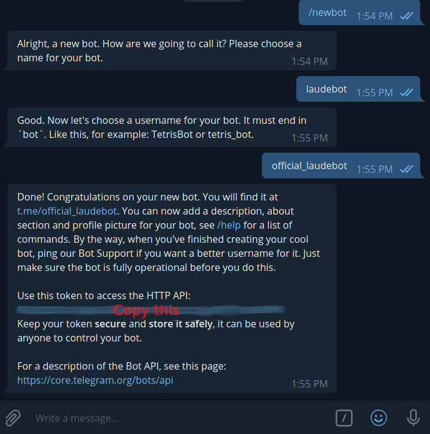

# Welcome to Laudekoodit 2020

## Prerequisites

  - Telegram account
  - Some knowledge of git

## Creating your first bot

1. Fork or clone this repository
2. Go to https://telegram.me/BotFather
3. Send message '/newbot'
4. Follow instructions

Your conversation should look something like this

**Copy the blurred line of text from your conversation, it is called a token and is vital for the next step**

## Connecting code to the bot

**If you haven't already now is the time to fork or clone this repository.**

Next we need to connect the code in this repository to the bot we just created.

1. Create a file called '.env' inside project directory
2. Inside .env write 'BOT_TOKEN=[INSERT TOKEN YOU COPIED HERE]' without the [] brackets

**Congratulation your bot is now finished. Run the code and test it out**

To build and run:

    npm install
    node index.js

### More information

Next you probably want start hacking and hustling on your teams bot. I've heavily commented index.js so you can use it as starting point for your own. For more detailed information visit https://telegraf.js.org/ 
